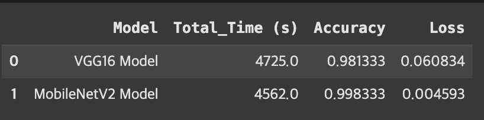

# 🥗 사전 학습 모델 VGG16, MobileNetV2를 활용한 Vegetable Image 분류 모델 연구 보고서

## 연구의 목적

본 연구의 목적은 야채 이미지 데이터셋을 활용하여 야채의 종류를 분류하는 모델을 개발하는 것이다. 이 데이터셋은 다양한 각도와 조명에서 촬영된 야채 이미지로 구성되어 있다. 총 15가지 종류의 야채로 구분되어 있다. 본 연구를 통해 이미지 분류 기술을 적용하여 야채 종류를 자동으로 식별하는 모델을 구축하고, 그 정확도를 평가하고자 한다.

본 연구에서는 아채 이미지 데이터셋의 분류 작업을 위해 사전 훈련 모델로 VGG16과 MobileNetV2를 선택하였다. 두 모델은 이미지 인식 분야에서 널리 활용되는 대표적인 합성곱 신경망(CNN)으로, 각기 다른 구조적 특징과 강점을 보유하고 있다. VGG16은 심층적인 구조를 바탕으로 복잡한 이미지 특성을 효과적으로 추출하여 높은 정확도를 나타내지만, 상대적으로 연산량이 많고 처리 속도가 느리다는 한계를 가진다. 반면 MobileNetV2는 경량화된 모델로서 모바일과 같이 제한된 환경에서도 높은 연산 효율을 제공하지만, 복잡한 이미지의 분류 정확도에서는 다소 한계를 드러낼 수 있다. 이러한 두 모델을 성능 및 효율성 측면에서 비교 분석하여 야채 이미지 데이터셋 분류 작업에 가장 적합한 모델을 도출하고자 한다.

---

## 데이터셋 설명

본 연구에 사용된 데이터셋은 Kaggle 플랫폼에 Misrak Ahmed가 공개한 ‘Vegetable Image Dataset’이다. 연구, 교육 등 다양한 목적으로 자유롭게 사용할 수 있도록 제공되고 있으며, 데이터셋의 원본 출처는 Kaggle에서 접근 가능하다(https://www.kaggle.com/datasets/misrakahmed/vegetable-image-dataset/data). 야채 15종류를 포함한 21000개의 이미지로 구성된다. 모든 이미지는 224x224 픽셀로, JPG 형식으로 제공된다. 

---

## 실험 방법

1. 기본 성능 비교
2. 성능 개선(VGG16)
3. 최적의 하이퍼파라미터 탐색
4. 파인튜닝

---

## 결과 및 분석

야채 이미지 데이터셋을 학습하기 위해 CNN을 활용하여 모델을 생성했으며, 모든 모델은 TensorFlow를 사용하여 구현하였다. TensorFlow는 딥러닝 모델 구현과 최적화에 유리하며, GPU 가속을 통해 학습 속도를 크게 향상시킬 수 있다. 대규모 데이터셋을 효율적으로 처리할 수 있다는 장점이 있기 때문에 해당 라이브러리를 선택했다. 그렇게 생성된 모델을 분석하고, 부족한 부분을 발견하고 보완한 과정과 그 결과에 대해 살펴보겠다.

아래는 VGG16모델과 MobileNetV2에 야채 이미지 데이터셋을 학습한 결과를 정리한 표이다.

|  | VGG16_basic | VGG16_generator | VGG16_hyper | VGG16_fine tunning |
| --- | --- | --- | --- | --- |
| Accuracy | 0.798 | 0.976 | 0.978 | 0.981 |
| Loss | 1.274 | 0.071 | 0.0009 | 0.060 |

|  | MobileNetV2_basic | MobileNetV2_hyper | MobileNetV2_finetunning |
| --- | --- | --- | --- |
| Accuracy | 0.998 | 0.997 | 0.998 |
| Loss | 0.007 | 0.009 | 0.004 |

---

### 결론

이러한 VGG16과 MobileNetV2 모델의 성능을 비교해보면 VGG16 모델의 총 학습시간은 78분, MobileNetV2의 총 학습시간은 총 76분으로 약 2분의 차이를 확인할 수 있었다. 학습시간은 약 2분 정도로 MobileNetV2가 더 우세하며, 정확도는 약 1%, 손실값은 약 7% 정도의 차이가 있음을 확인하였다. 

VGG16은 더 깊은 네트워크와 많은 파라미터로 높은 표현력을 가지지만, 계산 복잡도로 인해 학습 시간이 다소 길어지는 반면, MobileNetV2는 경량화 설계를 통해 학습 시간이 빠르며, 상대적으로 작은 성능 저하를 보이는 특성이 결과에 반영된 것으로 해석할 수 있다. 또한 야채 이미지 데이터셋 자체가 쉽게 구분할 수 있는 특징을 가지고 있어 복잡한 추론을 잘 학습하는 VGG16 모델보다 경량화된 MobileNetV2 모델이 야채 이미지 데이터셋에 더 적합함을 확인할 수 있다.
